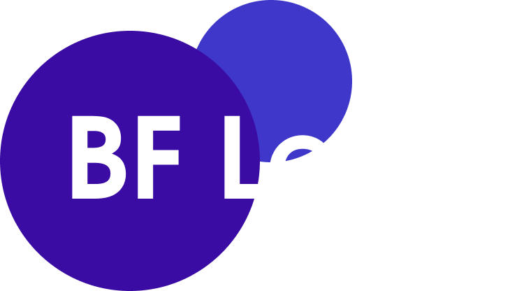
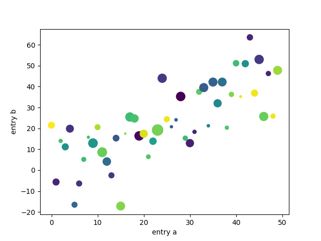

<div align="center">
  
<br><br>
<p>Машинное обучение на <code>Brainfuck</code>. Потому что можно. <br>Самый бесполезный проект в истории GitHub!</p>
</div>

Сейчас вы видите на 99.99% навайбкоденный ML фреймворк на [Brainfuck](https://ru.wikipedia.org/wiki/Brainfuck), цель которого — доказать, что это по-настоящему полный по Тьюрингу язык, на котором можно написать AGI. Реализация любого сложного компонента фреймворка сделана на Brainfuck с использованием LLM (`ChatGPT 5.2`)

<div align="center">
<table>
  <tr>
    <td align="center">
      
      <br>
      <strong>Regression</strong>
    </td>
    <td align="center">
      
      <br>
      <strong>Plotting</strong>
    </td>
  </tr>
</table>
</div>

## Установка
```cmd
git clone https://github.com/droyti46/bflearn.git
```

## Python API

Вдохновлён API [Scikit-learn](https://github.com/scikit-learn/scikit-learn)

```python
from bflearn.linear import BFLinearRegressionSGD

reg = BFLinearRegressionSGD(alpha=2)

x = [1, 2, 3, 4, 5]
y = [4, 5, 6, 7, 8]

reg.fit(x, y, epochs=9)
print(reg.predict(10))
```

Визуализировать точки и регрессию:

```python
from bflearn.plot import reg_plot

reg_plot(x=x, y=y, w=reg.w, b=reg.b)
```